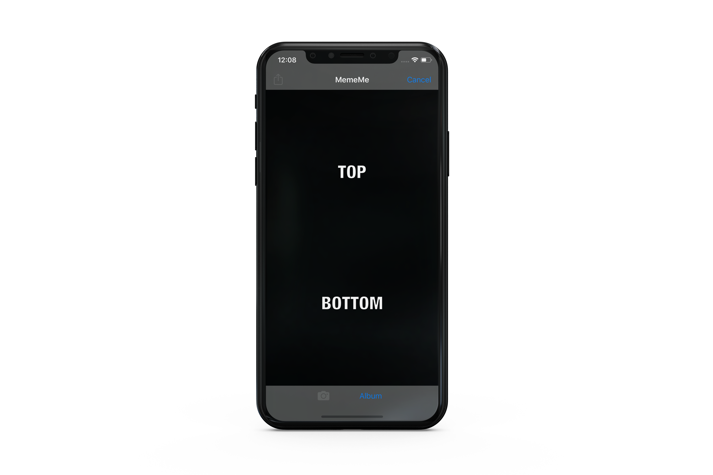
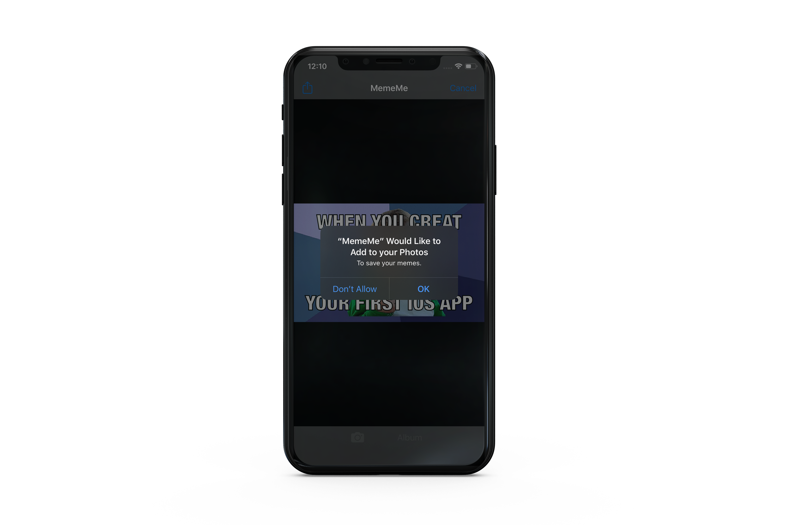
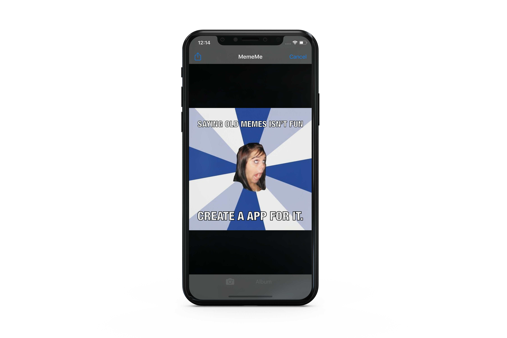
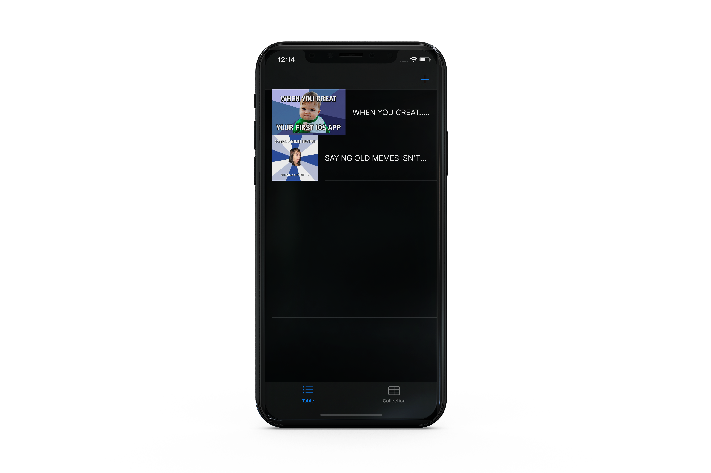
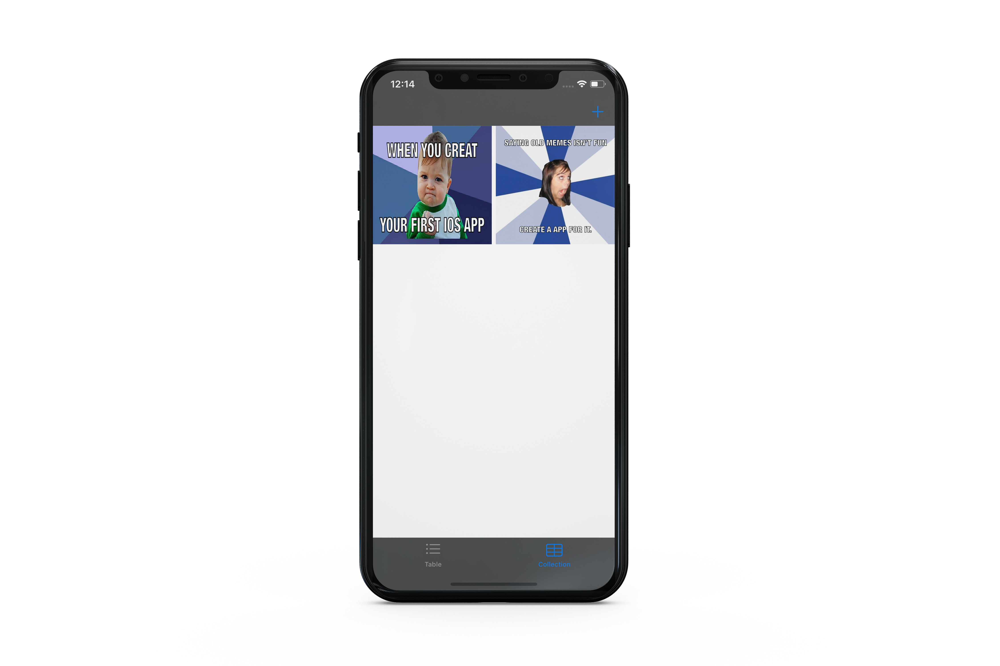

# MemeMe
 (Udacity iOS Developer Nanodegree.)
- MemeMe is an app that enables a user to take a picture using their photos from the media library or take one from their camera directly. Then and add text at the top and bottom to form a meme.
- User can share that meme on Facebook and Twitter and also by SMS or email. Sent memes will appear in a tab view using two views: a table view and a collection view.

## This project focused on
* Becoming comfortable using all of the key components of UIKit.

## Create a Meme screen

  

- Users will be asked for permission to access their media library or their camera.

  

- After adding the image and write texts.

  

## Two Tabs screen
### List view
- User all created memes are saved and appears in a list view.

  

### collection view
- User all created memes are saved and appears in a collection view.

  

## Dependencies:
* Apple UIKit
